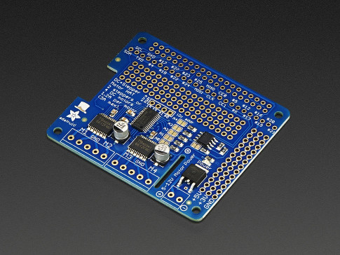

c++ [ROS](http://www.ros.org/) node wrapper for the [Adafruit DC & Stepper Motor HAT](https://www.adafruit.com/products/2348).



Based on tracing behaviour of the [AdaFruit Python lib](https://github.com/adafruit/Adafruit-Motor-HAT-Python-Library)

note: no code for the Stepper Motor control, just the DCs.

subscribes to `cmd` topic [std_msg::Int16MultiArray](http://docs.ros.org/jade/api/std_msgs/html/msg/Int16MultiArray.html)
messages expecting 4 values (one for each motor) between -255 (full reverse) to 255 (full forward). A value of 0 denotes turning
off motor. 

node sends stopAll on exit.

````
# skid steer right (assuming motor0 & 1 are left hand side)
rostopic pub -1 /cmd std_msgs/Int16MultiArray "{data:[200, 200, -200, -200]}"
````

TODOS
* no support for stepper control.
* integrate conversion of 4 values to a twist directly in this code (?)

